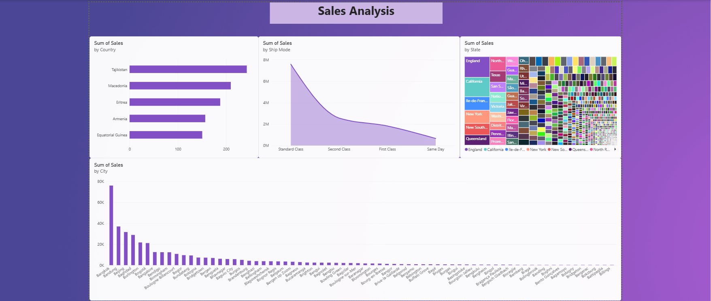
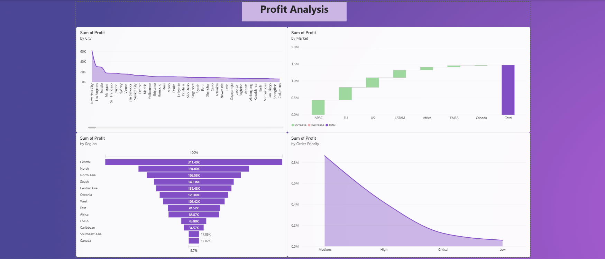
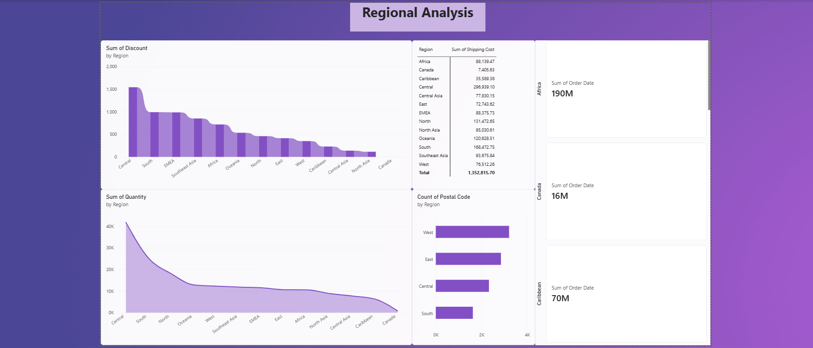

# Amazon Sales Dashboard | Power BI

## Project Overview

This project presents an interactive Amazon Sales Dashboard developed
using Microsoft Power BI.

The dashboard transforms sales transaction data into meaningful
business insights by analyzing sales, profit, quantity, shipping cost,
market performance, regional contribution, order priority, shipping
modes, and geographic trends.

The project demonstrates the use of business intelligence and data
visualization techniques to explore sales performance through
interactive dashboards.

## Project Objectives

- Transform raw sales data into meaningful visual insights.
- Monitor important business KPIs such as sales, profit, quantity,
  and shipping cost.
- Compare performance across markets, regions, countries, cities,
  and states.
- Analyze the relationship between shipping modes, order priority,
  and business performance.
- Create interactive dashboards using slicers and filters.
- Support data-driven business analysis through visual reporting.

## Tools and Technologies

- **Microsoft Power BI** – Dashboard development and visualization
- **Power Query** – Data preparation and transformation
- **DAX** – Measures and calculations
- **Microsoft Excel** – Dataset storage and data source
- **Data Visualization** – Business performance analysis

## Dataset

The project uses an Amazon sales transaction dataset stored in
Excel workbook format (`.xlsx`).

### Main Measures

- Sales
- Profit
- Quantity
- Shipping Cost
- Discount

### Main Dimensions

- Country
- Region
- Market
- City
- State
- Category
- Ship Mode
- Order Priority

## Dashboard Pages

### 1. Overall Sales Report

This page provides a high-level overview of business performance
using KPI cards, charts, slicers, and interactive filters.

It presents:

- Total Quantity
- Total Sales
- Total Profit
- Shipping Cost
- Sales by Category
- Sales by Market
- Sales by Country and City
- Sales by Shipping Mode

The page allows users to explore the overall sales mix and
geographical distribution of business performance.

### 2. Sales Analysis

The Sales Analysis page focuses on the distribution of sales across
different geographical and operational dimensions.

It includes analysis of:

- Sales by Country
- Sales by Shipping Mode
- Sales by State
- Sales by City

The visuals help identify leading locations, compare shipping modes,
and understand how sales are distributed across states and cities.

### 3. Profit Analysis

The Profit Analysis page examines profit contribution across
different business segments.

It includes:

- Profit by City
- Profit by Market
- Profit by Region
- Profit by Order Priority

The page helps explore geographical profit concentration and compare
profit contribution across order-priority categories.

### 4. Regional Analysis

The Regional Analysis page examines regional performance through
operational and sales-related indicators.

It includes:

- Discount comparison by Region
- Shipping Cost by Region
- Quantity by Region
- Postal-code counts
- Regional KPI cards

This page helps identify differences in regional sales activity,
shipping expenses, and quantity contribution.

## Dashboard Features

- Interactive KPI cards
- Slicers and filters
- Category-wise analysis
- Market-wise comparison
- Country and city analysis
- Regional performance analysis
- Shipping-mode comparison
- Order-priority analysis
- Profit contribution analysis
- Treemap visualization
- Waterfall chart
- Funnel chart
- Donut chart
- Bar charts and area charts

## Key Insights

The dashboard provides the following observations based on the
displayed report views:

- Sales and profit are geographically concentrated, with a limited
  number of cities and regions contributing significantly to totals.
- Standard Class is the most prominent shipping mode in the
  displayed sales analysis.
- Central appears as a leading region in the displayed profit and
  shipping-cost analysis.
- Technology, Office Supplies, and Furniture form the main category
  structure used for sales comparison.
- Order priority can be examined alongside profit to understand
  differences in profitability patterns.
- Shipping cost should be analyzed together with sales and profit
  because higher sales volume does not necessarily indicate higher
  profitability.

## Dashboard Preview

### Overall Sales Report


### Sales Analysis



### Profit Analysis



### Regional Analysis



## Project Files

- **Power BI Report** – Interactive `.pbix` dashboard file
- **Dataset** – Excel `.xlsx` source file
- **Screenshots** – Dashboard page previews
- **Documentation** – Detailed project report in Word format

## Suggested Repository Structure

```text
amazon-sales-powerbi-dashboard/
│
├── README.md
│
├── PowerBI_Report/
│   └── Amazon Sales Report.pbix
│
├── Dataset/
│   └── Amazon Sales Dataset.xlsx
│
├── Screenshots/
│   ├── Overall-Sales-Report.png
│   ├── Sales-Analysis.png
│   ├── Profit-Analysis.png
│   └── Regional-Analysis.png
│
└── Documentation/
    └── Amazon Sales Dashboard Report.docx
```

## Business Applications

The dashboard can support:

- Regional performance monitoring
- Sales and profit comparison
- Shipping-cost analysis
- Product-category comparison
- Geographic performance analysis
- Order-priority analysis
- Logistics and operational review

## Limitations

- The analysis is based on the available dataset and the figures
  displayed in the Power BI dashboard.
- Dashboard values may change when filters or slicers are applied.
- The analysis identifies patterns but does not establish their causes.
- Additional fields such as customer segments, returns, inventory
  levels, and product-level margins could improve the depth of analysis.

## Future Enhancements

- Add monthly and yearly sales trends.
- Include profit-margin analysis.
- Add customer-segment analysis if customer data is available.
- Include inventory and returns analysis.
- Add forecasting and time-series visuals.
- Improve drill-through functionality for detailed analysis.

## Conclusion

The Amazon Sales Dashboard converts sales data into an accessible
business intelligence report.

It brings together sales, profit, quantity, shipping cost, geography,
category, shipping mode, and order priority in an interactive
Power BI environment.

The project demonstrates practical skills in data preparation,
data visualization, dashboard design, and business intelligence
analysis.

## Author

**Mansi Jain**

**Tool Used:** Microsoft Power BI
